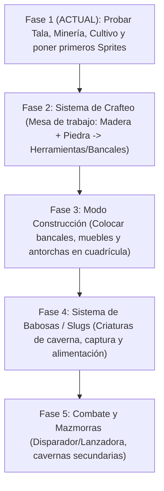

# 📖 Guía del Proyecto, Avances y Tareas Pendientes
> Guarda este documento a la mano. Aquí tienes el mapa completo de tu juego: qué está hecho, qué arte te toca hacer, cómo enchufarlo y qué sigue.

---

## 🗺️ 1. Mapa de Carpetas (Dónde va cada cosa)

| Carpeta | Para qué sirve |
|---|---|
| `art/terrain/` | Suelos, tierra, pasto y texturas del mapa. |
| `art/plants/` | Árboles, arbustos y plantas del entorno. |
| `art/buildings/` | Casas, entradas de cueva y estructuras. |
| `art/characters/` | Sprites del jugador y personajes. |
| `art/itemsUpdate/` | Íconos de items 16×16 (más de 1.200: materiales, herramientas, armas, comida...). |
| `art/_source/` | Tus archivos editables de Aseprite (`.ase`, `.aseprite`). |
| `scenes/levels/` | Los mapas jugables (`main.tscn`, `casa_interior.tscn`). |
| `scenes/objects/harvestables/` | Objetos talables/minables (`tree.tscn`, `rock.tscn`). |
| `scenes/objects/crops/` | Cultivos y bancales (`planter_box.tscn`, `wild_crop.tscn`). |
| `resources/items/` | Archivos de items (`.tres`): madera, piedra, hacha, semillas. |
| `resources/crops/` | Archivos de cultivos (`.tres`): tiempos, fases y frutos. |

---

## ✅ 2. Lo que YA está programado y funcionando

1. **Movimiento e Interacción**:
   - `WASD`: Moverte (8 direcciones) con animación.
   - `E`: Interactuar con cultivos y objetos que muestran `[E]`. Las puertas se activan al pisarlas.
   - `Clic Izquierdo`: Golpear con la herramienta activa. Solo alcanza lo que toca el área `ToolRange` del jugador (círculo editable en `player.tscn`); si hay varios, golpea el más cercano al cursor.
   - `Teclas 1 al 9` o `Rueda del Ratón`: Cambiar ranura de la barra rápida (Hotbar).
2. **Sistema de Tala y Minería**:
   - Árboles con sacudida y caída de troncos de madera al golpearlos con Hacha.
   - Rocas con caída de piedras al golpearlas con Pico.
   - Reaparición automática (respawn) tras agotarse.
3. **Imán de Recolección (Pickups)**:
   - Todo lo que cae al suelo flota con sombra y vuela automáticamente al jugador al pasar cerca.
4. **Sistema de Cultivos (Doble Enfoque)**:
   - **Bancales / Cajas de Cultivo (`planter_box.tscn`)**: Te acercas con semillas, presionas `E`, ves germinar la planta por 3 fases y al madurar presionas `E` para cosecharla.
   - **Plantas silvestres de caverna (`wild_crop.tscn`)**: Crecen solas en la tierra y vuelven a brotar al instante tras cosecharlas.
   - Los árboles y rocas tardan en reaparecer lo que diga su `respawn_time` (en el nodo `Harvestable` de `tree.tscn` = 20 s, `rock.tscn` = 25 s).
5. **Transición sin bucles**:
   - Puertas con punto de aparición exacto (`spawn_position`).
6. **El mundo se guarda al cambiar de escena** (`WorldState`):
   - Al entrar y salir de la casa se conservan los cultivos plantados, los árboles/rocas talados o dañados y los objetos tirados en el suelo.
   - El tiempo sigue corriendo mientras estás fuera: los cultivos crecen y los árboles reaparecen igual.
   - Para que un objeto nuevo se guarde: añádelo al grupo `persist` y dale `save_state()` y `load_state(data, elapsed)`.
   - Las puertas deben cambiar de escena con `WorldState.change_scene(ruta)`.
   - ⚠️ Cada objeto se reconoce por su nombre en la escena: si renombras un nodo (ej: `Tree1`), pierde su estado guardado en esa partida.
   - Aún no se guarda en disco: al cerrar el juego todo empieza de cero.
7. **Vida del jugador**:
   - Barra de vida arriba a la izquierda (`scenes/ui/health_bar.tscn`), cambia de color (verde → amarillo → rojo).
   - La vida se guarda en `Global` y se conserva al cambiar de escena. Usa `player.take_damage(n)` y `player.heal(n)`; la señal `died` avisa al llegar a 0.

---

## 🎨 3. Tu Lista de Tareas de Arte (Checklist de pendientes)

Puedes ir haciendo estos dibujos a tu propio ritmo. Cada vez que termines uno, ponle una `[X]`:

### A. Íconos de Inventario (16×16 px, en `art/itemsUpdate/`)
- [X] **Madera** → `tronco.png`
- [X] **Piedra** → `piedra.png`
- [X] **Hacha** → `hacha_cobre.png`
- [X] **Pico** → `pico_simple.png`
- [X] **Semilla Lumina** → `semilla.png`
- [X] **Flor Lumina** → `flor_azul.png`
- [X] **Corazón de la barra de vida** → `corazon.png`

### B. Elementos del Mundo
- [ ] **Sprite de Roca** (`art/terrain/rock.png`): Dibujar la roca para reemplazar el polígono actual de `rock.tscn`.
- [ ] **Caja de Cultivo / Bancal** (`art/plants/planter_box.png`): Rombo isométrico de madera con tierra oscura (aprox. 64×32 px).
- [ ] **Fases del Cultivo Lumina** (aprox. 24×24 o 32×32 px):
  - [ ] Fase 1: Brote saliendo de la tierra (`lumina_stage_1.png`).
  - [ ] Fase 2: Tallo con capullo a medio abrir (`lumina_stage_2.png`).
  - [ ] Fase 3: Flor adulta abierta brillante (`lumina_stage_3.png`).

---

## 🔌 4. ¿Cómo conectar tu nuevo arte a lo que ya está hecho? (En 2 clics)

### Para cambiar el dibujo de un Ítem:
1. Abre la carpeta `resources/items/` en el panel de Godot.
2. Haz doble clic en el item (ej: `wood.tres`).
3. En el **Inspector** a la derecha, arrastra tu imagen PNG al campo **`Icon`**. ¡Listo!

### Para cambiar las fases de un Cultivo:
1. Ve a `resources/crops/` y haz doble clic en `lumina_crop.tres`.
2. En el Inspector, despliega **`Growth Stage Textures`**.
3. Arrastra Fase 1 al índice 0, Fase 2 al índice 1, y Fase 3 al índice 2. ¡Listo!

### Para cambiar la forma de la Roca:
1. Abre `scenes/objects/harvestables/rock.tscn`.
2. En el nodo `dibujo`, borra los nodos `Polygon2D` y añade un `Sprite2D` con tu dibujo.

---

## ⏳ 5. Línea de Tiempo Recomendada (Roadmap de desarrollo)

1. **Paso 1 (Tu turno ahora)**: Juega en `main.tscn`, tala un árbol, pica una roca, planta en la caja de cultivo con `E`, y empieza a hacer los primeros íconos de 16x16.
2. **Paso 2 (Siguiente función para mí)**: Programar la **Mesa de Crafteo** (para que la madera y piedra que recolectas sirvan para fabricar cajas de cultivo, antorchas y mejores herramientas).
3. **Paso 3**: Modo colocación de muebles.
4. **Paso 4**: El sistema de Babosas (Slugs).
